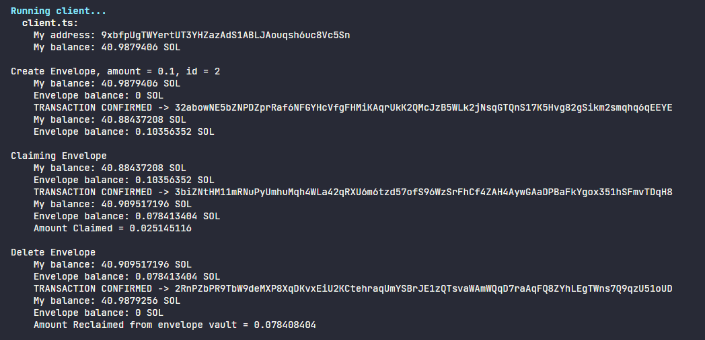

# Red Envelope Program

This Rust program implements a smart contract for managing red envelopes (also known as hongbao or angbao). It allows users to create envelopes with a specified amount of funds and a time limit for claiming. Other users can then claim funds from these envelopes, provided they meet certain conditions.

## Features

- **Create Envelope**: Users can create envelopes with a specified amount of funds and a time limit for claiming.
- **Claim Funds**: Users can claim funds from existing envelopes, subject to certain conditions such as time limit and availability of funds. Fund claim amount is random
- **Delete Envelope**: The owner of the envelope can delete it. Thereby reclaiming all the remaining balance

## Sample Client Run

